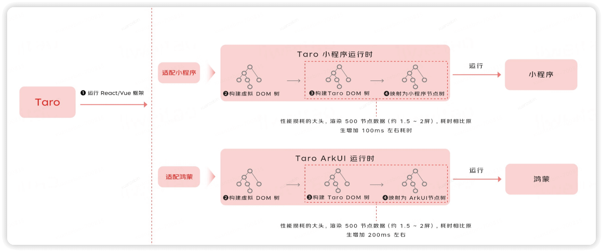
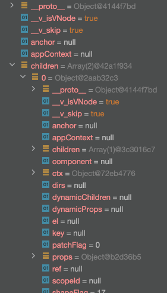
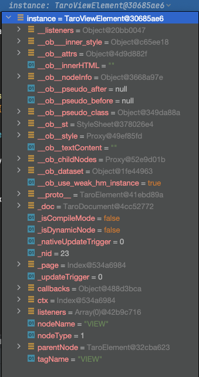

# taro-plugin-harmony-vue

## Taro 怎么将一个 Vue 组件跑在鸿蒙上的

> Taro 提供了多种维度的转换能力，可以将一个完整的 web（React、Vue） 应用转换成鸿蒙应用，也可以将一个封装好的 Web 组件转换成鸿蒙组件。本篇主要描述组件转换
Taro 是怎么将一个Vue组件跑在鸿蒙上的？

### 一、背景

Taro4.x 已经支持将 Taro 应用转换成鸿蒙的 ArkUI，由于 Taro 对这一功能的支持还不十分完善，目前只支持 React 技术栈，而现有的业务是基于 Vue 的业务无法使用。为了满足业务场景的需要，需要针对性地做能力补齐。

- Taro 官网的鸿蒙文档： https://taro-docs.jd.com/docs/next/harmony
- Taro RFC文档：https://github.com/NervJS/taro/discussions/14887

### 二、技术方案概述
由于完整的技术方案比较复杂，并且还处在验证阶段，本篇方案主要描述 Taro 转鸿蒙的整体流程，后续将会有更多细节性的内容
先借用 Taro RFC 中的一张图大概对 Taro 支持 ArkUI 做一个说明

上图中有一个很直观的信息，Taro 官方将适配鸿蒙和适配小程序做了类比，也就是说这二者之间有非常多的相似之处。前面的流程基本都是一致，只是最终到终端的渲染上需要做不同终端类型的适配。

### 三、Taro Vue 转换 ArkUI 的流程解析

#### 3.1 流程描述
首先无论是React还是Vue，Taro 都保留了完整的框架 runtime，也就是说 Taro 会把 React\Vue 应用的 js 逻辑（指生成虚拟DOM的过程）完整的运行起来，为了描述方便，后面统一用 Vue 做示例说明。在 Vue 虚拟DOM 树生成之后，Taro 自己编写了一套 DOM、BOM 结构，将虚拟DOM转换成了 Taro 的 DOM 树结构，这个 Taro DOM 树包含了一系列的父子节点以及每个节点对应的样式和内容属性。然后在不同的终端中，将这颗 Taro DOM 树通过递归的方式去创建 ArkUI 节点树，最终可以渲染。
需要说明的是由于 ArkUI 不支持 css 的解析和渲染，所以 Taro 在这里是在编译过程中将 css 解析成 inline-style，由于 inline-style 可以看成是 Taro DOM 节点的一个具体的属性，所以可以在递归生成 ArkUI 节点树的过程中去访问样式属性，最终可以使用 ArkUI 的方式去生成对应的样式，这一点跟微信小程序存在十分巨大的区别，微信小程序支持 css 的解析，所以无需做这个编译动作。

#### 3.2 Vue 组件的渲染过程
考虑到样式处理的复杂性，这个示例中先不对样式做说明
- 存在以下 vue3 组件

```tsx
import { defineComponent, ref } from 'vue'

export default defineComponent({
  setup() {

    const counter = ref(0)

    const onAdd = () => {
      counter.value++
    }

    return () => <view>
      <text class="title book">{counter.value}</text>
      <view class="button" onClick={onAdd}>ADD</view>
    </view>
  }
})
```
- 经过 Taro 编译之后，会将以上组件编译成（实际就是 vue3-jsx 的编译）

```tsx
const component = /* @__PURE__ */defineComponent({
  setup() {
    const counter = ref(0);
    const onAdd = () => {
      counter.value++;
    };
    return () => createVNode("view", null, [createVNode("text", {
      "__hmStyle": calcStaticStyle(__inner_style__(), "title book"),
      "className": "title book"
    }, [counter.value]), createVNode("view", {
      "__hmStyle": calcStaticStyle(__inner_style__(), "button"),
      "className": "button",
      "onClick": onAdd
    }, [createTextVNode("ADD")])]);
  }
});
```
以上代码就是一个编译好的 vue3 组件代码，会运行在 vue3 的运行时中，所以最终 component 会生成一个 vue3 的虚拟DOM树，树结构如右图：



得到了虚拟DOM树之后，Taro 会调用 createNativePageConfig 方法对 vue3 组件生成的 component 进行包装，得到一个 componentObj 对象，这个对象包含了一系列的生命周期方法：ONLOAD, ONUNLOAD, ONREADY, ONSHOW, ONHIDE ，其中最关键的是 ONLOAD 方法，会在鸿蒙组件初始化的时候用到。这里简单说明一下 ONLOAD 方法的实现：
```ts
// connect-native.ts
const componentObj: Record<string, any> = {
    ...
    [ONLOAD] (options: Readonly<Record<string, unknown>> = {}, cb?: TFunc) {
      ...    
      const mountCallback = () => {
        pageElement = document.getElementById($taroPath)
        ...
        cb && cb(pageElement)
        pageElement.ctx = this
      }
    
    
      const mount = () => {
        if (!Current.app) {
          initNativeComponentEntry({
            h,
            cb: () => {
              Current.app!.mount!(component, $taroPath, () => this, mountCallback)
            },
          })
        } else {
          // 3
          Current.app!.mount!(component, $taroPath, () => this, mountCallback)
        }
      }
    
      if (unmounting) {
        prepareMountList.push(mount)
      } else {
        mount()
      }
    }
}
```
这里先抛开鸿蒙，不考虑 ONLOAD 的执行时机，把所有的重点都放在 vue component 的渲染上面，关注的核心是 monut 方法，方法内首先是去检测 Current.app ，Current 对象是一个全局的通信模块，上面挂载了一些需要在不同模块之间共享的对象。Current.app 就是多个 vue component 组件需要挂载的 app 对象，其对应的实现就是 vue 中通过 createApp(...) 创建的应用对象，app 创建的过程在 initNativeComponentEntry 方法中，下面有一个简化版本的实现：
```ts
function initNativeComponentEntry (params: {h: typeof createElement, cb: TFunc}) {
  ...

  const NativeComponentWrapper = {
    props: ['getCtx', 'compId'],
    setup (props) {
        ...
    },
    render () {
      // 6
      return h(
        'root',
        {
          ref: 'root',
          id: this.compId
        },
        this.$slots.default()
      )
    }
  }

  
  const App = defineComponent({
    setup () {
      const components: PageItem[] = [];
      const componentsLength = ref(0)
        
      // 4
      function mount (component: ComponentOptions, compId: string, getCtx: () => any, cb) {
        ...
        const PageComponent: any = Object.assign({}, component)
        const option = PageComponent.props?.option?.default?.() || {}
        const ctx = getCtx()

        const page: ComponentOptions = {
          mounted () {
            ctx.component = this
            nextTick(() => {
              // 7
              cb();
            });
          },
          ...
          
          // 5
          render () {
            return h(
              NativeComponentWrapper,
              {
                compId,
                getCtx
              },
              {
                default () {
                  return [
                    h(PageComponent, {
                      tid: compId,
                      option,
                      ...(ctx ||= {}).props,
                      _scope: ctx
                    })
                  ]
                }
              }
            )
          }
        }


        components.push({
          compId,
          component: page
        });

        componentsLength.value += 1;
      }

      function unmount (compId: string) {
          ...
      }
      
      // 2
      onMounted(() => {
        Current.app = {
          mount: mount as any,
          unmount
        };
        cb?.();
      })

      return {
        componentsLength,
        components
      }
    },
    render () {
      return this.components.map(page => h(page.component, { key: page.compId }))
    }
  })

  // 1
  createApp(App)
      // 8
      .mount('#app')
}
```
以上简化之后的代码通过黄色背景标示出了重要的运行代码段，红色的文字 1-8 标示了执行的流程，首先会通过 createApp 方法创建 vue3 应用，App 组件内部去做 this.components 数组的渲染，在 onMounted 内部给 Current.app 赋值，然后在 3 进行调用，5 去执行 NativeComponentWrapper 组件的初始化，需要注意的是 NativeComponentWrapper 组件上添加了 id 属性，PageComponent 组件就是需要渲染的 vue3 component ，在 vue runtime 中将所有的组件都生成虚拟DOM之后，开始执行 mount('#app') 操作，mount('#app') 在 web 应用中是一个 DOM 操作，但是在 Taro 转鸿蒙中，鸿蒙并没有 DOM和BOM等对象，Taro 实现了一套自己的 DOM 和 BOM，具体的实现方式如下：
```ts
// 例如在 @vue/runtime-dom 中可能会有如下执行

const div = document.createElement('div');
div.setAttr('id', 'app');

// 在 Taro 会给 @vue/runtime-dom 注入如下代码
import { document, window } from '@tarojs/runtime'

// document 是 taro 自己提供的对象，对标实现了 dom 中的api，例如：createElement 方法，这样所有的 dom 操作就可以转换成 taro 的 DOM 树结构
```
同样地，通过给 NativeComponentWrapper 组件添加 id 属性，也会在 Taro 的DOM树中记录这颗虚拟的 Taro DOM，最终 connect-native.ts 中的 mountCallback pageElement = document.getElementById($taroPath) 将会获取到对应的 Taro DOM 树：



#### 3.3 ArkUI 组件的渲染过程

1. ArkUI 模板组件

经过上述步骤之后，获得了一颗完整的单组件的 Taro DOM 树，如何将这颗 Taro DOM 树转换成 ArkUI 是接下来需要解析的内容。
再回到前面提到的 ONLOAD 生命周期方法执行时机，该方法的执行实际上是在 ArkUI 组件内部开始调用，调用完成之后会将生成的 Taro DOM 树作为结果返回，ArkUI 组件拿到这颗树之后就开始递归进行渲染动作。
在 Taro 的构建(vite 构建)过程中，除了跟 web 一样会将原始的 Vue Component 编译得到一个可以运行在 Vue Runtime 上的代码片段，还会额外生成一个符合 ArkUI Component 规范的组件模版代码，之所以称之为模板代码，是因为这个组件的内容是固定的。简化之后的代码段内容如下：
以下代码跟 Taro 官方的代码片段有一定的区别，官方的代码是 Component 规范的，下述代码是 ComponentV2 规范的
```ts
// createComponent 方法就是生成 vue component 的入口方法，调用之后将得到 componentObj 对象
import createComponent from "./index.js";

@ComponentV2
export default struct Index {
  // 参数声明
  page?: PageInstance
  onReady?: TaroAny
  // 可观察的 node 节点，用来接受 Taro DOM 树对象
  @Local node: (TaroElement | null) = null
  @Local layerNode: (TaroElement | null) = null
  // 暴露给外部使用的 props，最终会同步到 vue component 的 props 上
  @Param props: TaroObject = {}
  
  // 监听 props 的变化，强制 rerender vue component
  @Monitor('props')
  propUpdateHandle() {
    (this as TaroObject).component?.$forceUpdate?.();
  }

  // arkUI 生命周期方法
  aboutToAppear () {
    initHarmonyElement()
    this.handlePageAppear()
  }

  // arkUI 生命周期方法
  aboutToDisappear () {
    callFn(this.page?.onUnload, this)
  }

  handlePageAppear () {
    const params = router.getParams() as Record<string, string> || {}
    // 得到 componentObj 对象
    this.page = createComponent()
    // 给 componentObj 的 onReady 方法绑定 this
    this.onReady = bindFn(this.page?.onReady, this.page)
    // 关键的方法，开始执行 onLoad，回调函数中的 instance 就是 Taro DOM 树对应的对象
    callFn(this.page?.onLoad, this, params, (instance: TaroElement) => {
      // @Local 发生一次赋值操作，将会引起 arkUI 组件的渲染
      this.node = instance
    })
    callFn(this.page?.onReady, this, params)
  }

  build () {
    if (this.node) {
      // TaroView 是一个 ArkUI 自定义组件，内部会执行递归渲染操作，将 Taro DOM 树转换成符合 vue component 结构的 ArkUI 组件结构
      TaroView({ node: this.node as TaroViewElement, createLazyChildren: createLazyChildren })
      if (this.layerNode) {
        Stack() {
          createLazyChildren(this.layerNode as TaroElement, 1)
        }
        .position({ x: 0, y: 0 })
        .height('100%')
        .width('100%')
        .responseRegion({ x: 0, y: 0, width: 0, height: 0 })
      }
    }
  }
}
```
上面的模板代码不多，但是每一步都很有用，针对每一步的动作都做了说明，对核心代码的执行做了背景标黄，核心逻辑就是在 ArkUI 组件的 aboutToAppear 生命周期方法中，调用 componentObj.onLoad 生命周期方法，得到 Taro DOM 树对象，然后将结果赋值给状态变量 node，最终的 build 渲染方法内去递归渲染。

2. ArkUI 递归渲染的过程解析

在 ArkUI 模板组件代码中渲染了一个 Taro 提供的 TaroView 自定义组件，该组件有两个参数 node 和 createLazyChildren ，node 已经做过说明，createLazyChildren 实际上是一个全局的 Builder ，递归渲染的过程就在这个 Builder 中。先看一下 TaroView 的简单版本：

```ts
@ComponentV2
export default struct TaroView {
  @Builder customBuilder() {}
  @BuilderParam createLazyChildren: (node: TaroViewElement, layer?: number) => void = this.customBuilder
  @Param @Require node: TaroViewElement
  @Local overwriteStyle: Record<string, TaroAny> = {}

  aboutToAppear(): void {
    ...
  }

  build () {
    if (...) {
        ...
    } else {
      Column() {
        // 处理 ::before ::after 等伪元素，可忽略
        if (this.node._pseudo_before || this.node._pseudo_after) {
          PseduoChildren({ node: this.node, createLazyChildren: this.createLazyChildren })
        } else {
          this.createLazyChildren(this.node, 0)
        }
      }
      // 绑定样式和方法 省略
    }
  }
}
TaroView 组件的实现最大的功能就是调用 createLazyChildren 这个 Builder，代码如下：

@Builder
function createChildItem (item: TaroElement, createLazyChildren?: (node: TaroElement, layer?: number) => void) {
  if ((item.tagName === 'SCROLL-VIEW' || item._st?.hmStyle.overflow === 'scroll') && item.getAttribute('type') === 'custom') {
    TaroScrollList({ node: item as TaroScrollViewElement, createLazyChildren })
  } else if (item.tagName === 'SCROLL-VIEW' || item._st?.hmStyle.overflow === 'scroll') {
    TaroScrollView({ node: item as TaroScrollViewElement, createLazyChildren })
  } else if (item.tagName === 'VIEW') {
    TaroView({ node: item as TaroViewElement, createLazyChildren })
  } else if (...) {
    ...
  } else {
    TaroView({ node: item as TaroViewElement, createLazyChildren })
  }
}

@Builder
function createLazyChildren (node: TaroElement, layer = 0) {
  LazyForEach(node, (item: TaroElement) => {
    if (!item._nodeInfo || item._nodeInfo.layer === layer) {
      createChildItem(item, createLazyChildren)
    }
  }, (item: TaroElement) => `${item._nid}-${item._nativeUpdateTrigger}-${item._nodeInfo?.layer || 0}`)
}
```

通过 LazyForEach 去渲染 node，LazyForEach 要求实现 IDataSource 中的 totalCount、getData 等方法，TaroElement 经过几层派生之后已经具备了这些方法，在第二个回调函数中，会去执行 createChildItem 这个 Builder ，并且会将 createLazyChildren 继续往下传递，在 createChildItem 中通过 item.tagName 判断得到的还是一个 TaroView 组件，结合前面的逻辑可以清楚最终还会走到 createLazyChildren 中，最终实现了递归调用，可能会得到一系列的 Column 、Text 等 ArkUI 对应的原生组件，从而实现整个 ArkUI 的渲染。

### 四、组件使用

经过上面流程的解析，已经可以将一个 Vue 组件转换成一个 ArkUI 组件了，接下来就可以在 Page 或者其他 Component 中去使用这个组件了。

```ts
import TaroVueComponent from './taro-vue-component'

@Entry
@ComponentV2
struct Index {
  @Local checked: boolean = false;

  build() {
    Row() {
      Column() {
        TaroVueComponent({
          props: {
            modelValue: this.checked,
            updateModelValue: (value: boolean) => {
              this.checked = value;
            }
          }
        })
      }
      .width('100%')
    }
    .height('100%')
  }
}
```
上面是一个组件被使用的简单代码片段，所有的参数需要通过统一的 props 属性传递到经过转换之后的组件上，以便于在组件内部可以被正确地观察到进而执行强制 vue component 的 rerender
- 效果图


### 五、小结

以上就是简化版的 Taro 实现 Vue 转换成 ArkUI 组件的过程，整个过程分析了 Vue component 到 Taro Dom 树再到 ArkUI 组件的过程，当然其中缺少了很多细节，例如：ArkUI 组件跟 Vue 组件的通信细节，css 样式是怎么被渲染到 ArkUI 上的、Taro DOM 树的更多细节、@vue/runtime-dom 怎么被改写的等更多细节。
在明白了上面的流程之后，接下来需要做的就是在 Taro 现有的功能基础之上（目前 Taro 官方仅支持 React 的转换），深入 Taro 的转换过程之中，来实现 Vue 版本的组件转换。
为了实现这个转换又不侵入Taro 的源代码，实现了一个 Taro 插件来完成这个能力，这个转换过程的详细描述将在后文中进行解析。


## Taro 支持 vue3.x 转鸿蒙还需要做些什么？

> 前文描述清楚了 Taro 是怎么将一个 vue 组件转换成鸿蒙组件的，其中结合了运行时的工作和编译期的工作。首先来看一下，为什么 Taro 还不支持将一个 vue 组件转换成鸿蒙。

### 一、编译阶段

Taro 为了兼容不同的平台创造一套注册平台的方式来实现对平台多态的支持。鸿蒙也不例外，Taro 提供了 @tarojs/plugin-platform-harmony-ets 平台插件实现对鸿蒙的转换支持，其入口文件的代码如下：

```ts
export default (ctx: IPluginContext, options: IOptions = {}) => {
  // 合并 harmony 编译配置到 opts
  // 通过 modifyRunnerOpts 这个钩子来修改 taro 构建的配置项
  ctx.modifyRunnerOpts(({ opts }) => {
    if (opts.platform !== PLATFORM_NAME) return

    // 读取用户配置（项目/config/index.js）中与 harmony 相关的配置
    const harmonyConfig = ctx.ctx.initialConfig.harmony
    assertHarmonyConfig(ctx, harmonyConfig)

    harmonyConfig.name ||= 'default'
    harmonyConfig.hapName ||= 'entry'
    const { projectPath, hapName } = harmonyConfig
    opts.outputRoot = path.join(projectPath, hapName, 'src/main', options.disableArkTS ? 'js' : 'ets')
    opts.harmony = harmonyConfig
    ctx.paths.outputPath = opts.outputRoot
  })

  // taro 同时支持 JSUI 和 ArkUI，本文主要是支持 ArkUI 的说明
  const Harmony = options.disableArkTS ? HarmonyOS_JSUI : HarmonyOS_ArkTS
  // 注册平台 
  ctx.registerPlatform({
    name: PLATFORM_NAME,
    useConfigName: options.useConfigName || PLATFORM_NAME,
    async fn ({ config }) {
      // 初始化 harmony 相关的构建工作
      const program = new Harmony(ctx, config)
      // 正式开始执行构建
      await program.start()
    }
  })
}

// Harmony 类的代码如下

export default class Harmony extends TaroPlatformHarmony {
  ...

  constructor(ctx: IPluginContext, config: TConfig) {
    super(ctx, config)
    const that = this
    // 通过 setupTransition 注册 close，在 peform 执行完成之后执行
    this.setupTransaction.addWrapper({
      close() {
        that.modifyViteConfig()
      },
    })
    ...
  }
  
  // 需要被拷贝的依赖项，很明显没有 vue 相关的内容，并且包含了 react 相关的内容，所以这里是后续需要修改的
  externalDeps: [string, RegExp, string?][] = [
    ['@tarojs/components/types', /^@tarojs[\\/]components[\\/]types/],
    ['@tarojs/components', /^@tarojs[\\/]components([\\/].+)?$/, this.componentLibrary],
    ['@tarojs/react', /^@tarojs[\\/]react$/],
    ['@tarojs/runtime', /^@tarojs[\\/]runtime([\\/]ets[\\/].*)?$/, this.runtimeLibrary],
    ['@tarojs/taro/types', /^@tarojs[\\/]taro[\\/]types/],
    ['@tarojs/taro', /^@tarojs[\\/]taro$/, this.apiLibrary],
    ['@tarojs/plugin-framework-react/dist/runtime', /^@tarojs[\\/]plugin-framework-react[\\/]dist[\\/]runtime$/, this.runtimeFrameworkLibrary],
    ['react', /^react$|react[\\/]cjs/],
    ['react/jsx-runtime', /^react[\\/]jsx-runtime$/], // Note: React 环境下自动注入，避免重复
  ]
  
  ...
  
  modifyViteConfig() {
    ...
    this.externalDeps.forEach(([libName, _, target]) => {
      // 拷贝需要被 external 的依赖项到 output中
      this.moveLibraries(target || libName, path.resolve(targetPath, libName), appPath, !target)
      })
  }
}
```

program.start 在执行完一些初始化的操作之后，开始调用 vite 执行构建动作

```ts
// https://github.com/NervJS/taro/blob/main/packages/taro-platform-harmony/src/program/harmony.ts

  /**
   * 调用 runner 开启编译
   */
  public async start () {
    // setup 执行之后会去执行上面构造函数中的 close 方法，close 方法将会修改 vite 的构建配置
    await this.setup()
    // 执行编译，最终会去调用 buildHarmonyApp
    await this.build()
  }
  
  private async buildHarmonyApp (extraOptions = {}) {
    // 获取 vite
    const runner = await this.getRunner()
    // 获取 vite 构建配置
    const options = this.getOptions(Object.assign({
      runtimePath: this.runtimePath,
      taroComponentsPath: this.taroComponentsPath,
    }, extraOptions))
    // 执行 vite 构建
    await runner(options)
  }
this.getRunner() 实际上获取的不是 vite 本身，而是经过 taro 封装之后的 @tarojs/vite-runner，精简之后的代码：
import harmonyPreset from './harmony'

export default async function (appPath: string, rawTaroConfig: ViteHarmonyBuildConfig) {
  const viteCompilerContext = new TaroCompilerContext(appPath, rawTaroConfig)
  const { taroConfig } = viteCompilerContext
  // 注册harmony构建需要使用到的默认插件
  const plugins: UserConfig['plugins'] = [
    harmonyPreset(viteCompilerContext)
  ]
  ...
  await build(commonConfig)
}

// harmonyPreset 包含如下插件

import ...

import type { ViteHarmonyCompilerContext } from '@tarojs/taro/types/compile/viteCompilerContext'
import type { UserConfig } from 'vite'

export default function (viteCompilerContext: ViteHarmonyCompilerContext): UserConfig['plugins'] {
  return [
    pipelinePlugin(viteCompilerContext),
    configPlugin(viteCompilerContext),
    stylePlugin(viteCompilerContext),
    compileModePrePlugin(viteCompilerContext),
    assetPlugin(viteCompilerContext),
    entryPlugin(viteCompilerContext),
    // 生成 ets 文件页面模板以及将打包web组件，耦合了 react 相关的逻辑
    pagePlugin(viteCompilerContext),
    etsPlugin(viteCompilerContext),
    multiPlatformPlugin(viteCompilerContext),
    emitPlugin(viteCompilerContext),
    // 改插件如果处理 .vue 文件，将会报错，所以需要修改不让其执行 .vue 文件的处理
    importPlugin(viteCompilerContext),
    // 样式处理，vite 在构建 vue 的样式文件时，会针对 <style> 中的内容做处理，需要修改
    stylePostPlugin(viteCompilerContext),
  ]
}
```
综合上面的内容，为了让 Taro 支持 vue3 到 鸿蒙的转换支持，在编译阶段需要对部分文件做修改：
- 在 HarmonyArkTs.ts 中，修改 externalDeps，移除 react 相关的依赖同时增加 vue 相关的依赖
- 在 vite-runner 中修改部分用于转换 web 到 鸿蒙的 vite 插件

### 二、运行阶段

Taro 是一款重运行时的跨端框架，在编译期做了支持 vue 文件的构建改造之后，还有相当一部分内容需要在运行时去支持。
在上一篇中已经说明Taro保留了完整的 React/Vue Runtime，支持将 React/Vue 组件变成虚拟对应的DOM，在源代码中 Taro 提供了 @tarojs/plugin-platform-harmony-ets/src/runtime-framework/react 以支持运行时的代码，但是缺少了 vue 相关的实现，所以这也是 Taro 暂时还不支持 vue转换的一个原因。这个模块的主要功能如下：
```ts
// 创建 react app
export * from './app'
export * from './connect'
// 对标 Taro 的跨平台实现，提供 react 对应版本的钩子
export * from './hooks'
// 将 react 组件渲染成 harmony 组件所需要的虚拟DOM
export * from './native-page'
// 将 react 页面渲染成 harmony 页面所需要的虚拟DOM
export * from './page'
另外考虑到 vue-dom 中依赖到了 TaroDOM 树提供的虚拟节点，同样需要拷贝一份 vue-dom 和 TaroDOM 对应的内容，并且实现二者的通信工作。
- 提供 @vue/runtime-dom 对应的版本代码到运行时代码中
- 提供 @tarojs/plugin-platform-harmony-ets/src/runtime-framework/react 对应的 vue 代码到运行时代码中，二者区别其实不大
最后还有一个问题，在鸿蒙组件中 ComponentV1 版本的组件无法做深度的数据变更监听，导致了很多功能的缺失，为了弥补这一不足，修改了 Taro 中默认使用 ComponentV1 的方式为 ComponentV2 ，其主要变更为
- 拷贝 @tarojs/plugin-platform-harmony-ets/src/components-harmony-ets 中的现实代码到运行时代码中，并且修改组件的修饰方式
@Component
export default struct TaroView {
  @Builder customBuilder() {}
  @BuilderParam createLazyChildren: (node: TaroViewElement, layer?: number) => void = this.customBuilder
  @ObjectLink node: TaroViewElement
  @State overwriteStyle: Record<string, TaroAny> = {}
  ...
}

// 修改为：👇

@ComponentV2
export default struct TaroView {
  @Builder customBuilder() {}
  @BuilderParam createLazyChildren: (node: TaroViewElement, layer?: number) => void = this.customBuilder
  @Param @Require node: TaroViewElement
  @Local overwriteStyle: Record<string, TaroAny> = {}
  ...
}
```

### 三、改造点

1. 编译

- 通过重写 HarmonyArkTs.ts 修改 externalDeps
```ts
resetProp() {
    this.externalDeps = [
      ['@tarojs/components/types', /^@tarojs[\\/]components[\\/]types/],
      ['@tarojs/components', /^@tarojs[\\/]components([\\/].+)?$/, this.componentLibrary],
      ['@tarojs/runtime', /^@tarojs[\\/]runtime([\\/]ets[\\/].*)?$/, this.runtimeVue3Library],
      ['@tarojs/taro/types', /^@tarojs[\\/]taro[\\/]types/],
      ['@tarojs/taro', /^@tarojs[\\/]taro$/, this.apiLibrary],
      ['@tarojs/plugin-framework-vue3/dist/runtime', /^@tarojs[\\/]plugin-framework-vue3[\\/]dist[\\/]runtime$/, this.runtimeVue3FrameworkLibrary],
      ['vue', /^vue$|vue[\\/]dist[\\/]vue.esm-browser\.js/],
      ['@vue/runtime-dom', /^@vue[\\/]runtime-dom/, this.runtimeVueRuntimeDom],
      ['taro-runtime', /taro-runtime$/, this.taroRuntime],
      ['@vue/reactivity', /^@vue[\\/]reactivity/],
      ['@vue/runtime-core', /^@vue[\\/]runtime-core/],
      ['@vue/shared', /^@vue[\\/]shared/],
    ];
  }
```
- 通过重写 vite-runner 来修改对应的 vite 插件

```ts
import multiPlatformPlugin from '@tarojs/vite-runner/dist/common/multi-platform-plugin'
import { assetPlugin } from '@tarojs/vite-runner/dist/harmony/asset'
import importPlugin from './babel'
import { compileModePrePlugin } from '@tarojs/vite-runner/dist/harmony/compile'
import configPlugin from '@tarojs/vite-runner/dist/harmony/config'
import emitPlugin from '@tarojs/vite-runner/dist/harmony/emit'
import entryPlugin from '@tarojs/vite-runner/dist/harmony/entry'
import etsPlugin from '@tarojs/vite-runner/dist/harmony/ets'
import pagePlugin from './page'
import pipelinePlugin from '@tarojs/vite-runner/dist/harmony/pipeline'
import customConfigPlugin from './config'
import { stylePlugin, stylePostPlugin } from './style-native'

import type { ViteHarmonyCompilerContext } from '@tarojs/taro/types/compile/viteCompilerContext'
import type { UserConfig } from 'vite'

export default function (viteCompilerContext: ViteHarmonyCompilerContext): UserConfig['plugins'] {
  return [
    customConfigPlugin(viteCompilerContext),
    pipelinePlugin(viteCompilerContext),
    configPlugin(viteCompilerContext),
    stylePlugin(viteCompilerContext),
    compileModePrePlugin(viteCompilerContext),
    assetPlugin(viteCompilerContext),
    entryPlugin(viteCompilerContext),
    pagePlugin(viteCompilerContext),
    etsPlugin(viteCompilerContext),
    multiPlatformPlugin(viteCompilerContext),
    emitPlugin(viteCompilerContext),
    importPlugin(viteCompilerContext),
    stylePostPlugin(viteCompilerContext),
  ]
}
```

1. 运行

- 提供 this.runtimeVueRuntimeDom 对应的 vue-dom，修改其中对 window、document 全局对象的依赖
```ts
import { get, getSvgElement } from '../../taro-runtime'

const getDoc = () => typeof get('document') !== "undefined" ? get('document') : null;
const getUnsafeToTrustedHTML = () => getPolicy() ? (val) => getPolicy().createHTML(val) : (val) => val;
- 提供 runtime-ets
- 提供 runtime-framework/vue3 
// 提供 vue 对应的 composition api 来对齐 taro 跨平台的实现
export * from './composition-functions'
// 创建 vue app 和 page 对应的运行时代码
export * from './connect'
// 创建 vue app 和 组件对应的运行时代码
export * from './connect-native'
export * from './plugins'
// 创建 vue page 对应的运行时代码
export * from './page'
```

- 提供 components-harmony-ets 实现 taro 对应的基础组件

### 四、小结
通过以上步骤可以补齐 taro 对 vue 转鸿蒙的支持，在补齐的过程中需要大量分析vue 转 小程序的实现、react 转鸿蒙的实现，结合二者的现实再完善vue 转鸿蒙的实现
